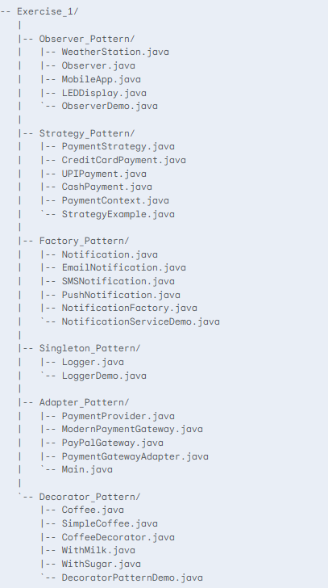
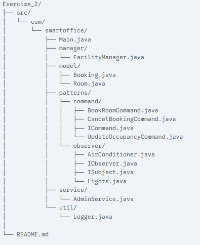

# Smart-Office-Facility-
This is a project about SmartOffice Facility System.
# Exercise 1 - Problem Statement on Design patterns
This exercise contains use cases to demonstrate six common design patterns.

## Project Structure

## Behavioural Design Patterns
1. Observer: A weather station notifies multiple displays (observers) when the temperature changes.

2. Strategy: A payment system allows choosing a payment method (strategy) at runtime (e.g., Credit Card, UPI, Cash).

## Creational Design Patterns
1. Factory: A notification factory creates different types of notifications (SMS, Email, Push) on demand.

2. Singleton: A single logger instance is used across the entire application to handle all log messages.

## Structural Design Patterns
1. Adapter: An adapter allows a new, incompatible payment gateway to work with an old system's payment interface.

2. Decorator: A coffee's functionality (cost and description) is dynamically extended by adding decorators like milk and sugar.

# Exercise 2 - Smart Office Facility Management System
This project is a console-based application designed to manage a smart office facility. It handles conference room bookings, detects room occupancy, and automates the control of air conditioning and lighting. The application is built with a strong focus on clean architecture, SOLID principles, and the strategic implementation of software design patterns to ensure a robust, maintainable, and scalable solution.

## Project Structure

## Architectural Design & Patterns
The core of this application is built upon three fundamental design patterns. These patterns were chosen specifically to address the project requirements, creating a system that is decoupled, easy to understand, and simple to extend.

## Singleton Pattern
Class: FacilityManager

Role: Singleton

Pattern Used: Singleton Pattern

## Observer Pattern
Classes: Room, Lights, AirConditioner

Interfaces: ISubject, IObserver

Roles:

Subject: Room

Observers: Lights, AirConditioner

Pattern Used: Observer Pattern

## Command Pattern
Classes: Main, FacilityManager, BookRoomCommand, CancelBookingCommand, UpdateOccupancyCommand

Interface: ICommand

Roles:

Invoker: Main

Receiver: FacilityManager

Commands: BookRoomCommand, CancelBookingCommand, UpdateOccupancyCommand

Pattern Used: Command Pattern

## Features
Dynamic Facility Configuration: Configure the number of meeting rooms at runtime.

Booking Management: Book and cancel conference rooms for specific time slots with conflict detection.

Occupancy Simulation: Update the number of occupants in a room to simulate real-world sensor data.

Automated Controls: Air conditioning and lights automatically turn on/off when a room's occupancy status changes (triggered when 2 or more people are present).

Interactive Console UI: A user-friendly, prompt-based interface for easy interaction and guided input.

Immediate Input Validation: Prevents users from entering invalid data, such as non-existent room numbers, before asking for further details.

Admin Panel: A password-protected view (admin123) to get a summary of all current bookings, fulfilling the user authentication requirement.

## For compile and Run
 1. Move to Smart-Office-Facility-\Exercise_2\src\com
 2. For compiling 

### javac -d ../bin com/smartoffice/Main.java com/smartoffice/manager/FacilityManager.java com/smartoffice/model/*.java com/smartoffice/patterns/command/*.java com/smartoffice/patterns/observer/*.java com/smartoffice/service/*.java com/smartoffice/util/Logger.java
 3. To run the Project
 ### java -cp bin com.smartoffice.Main 

# Outputs

## Configuring the rooms 

## Add/Update Occupants

## Room Booking

## Cancel Booking

## Admin side

## help and exit

